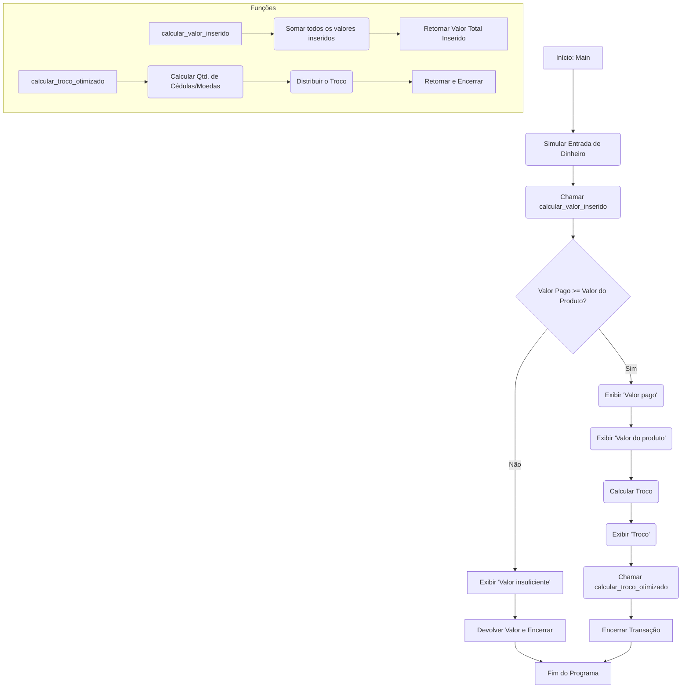

# Maquina de vendas em MIPS 32


### Sobre o projeto
> Este projeto é reflexo de uma proposta como primeira atividade avaliativa no sentido de desenvolver
programa de baixo nível com base em uma arquitetura de microprocessador. O trabalho é baseado
na arquitetura MIPS.


### Tecnologias Utilizadas
MIPSx32 Assembly

### FlowChart:



## 💻 Pré-requisitos

Antes de começar, verifique se você atendeu aos seguintes requisitos:

- Você instalou a versão mais recente do `Java Runtime Environment (JRE)`.
- Você tem uma máquina `Windows`, `macOS` ou `Linux`. O `MARS` é multiplataforma e funciona em qualquer um desses sistemas operacionais, desde que o `JRE` esteja instalado.
- Você tem conhecimento básico em `Assembly MIPS 32-bit`, incluindo a arquitetura, registradores, instruções e o funcionamento da memória.

## 🚀 Baixando e Executando o Mars

Para baixar e executar o simulador MARS, siga estas etapas simples:

<h5>Acesse o site oficial do MARS (ou um repositório como o GitHub) para baixar a versão mais recente do arquivo Mars.jar.</h5>

- Salve o arquivo em qualquer pasta do seu computador (como a pasta Downloads ou Documentos).

<h5> Para executar o Mars, você pode fazer uma das seguintes opções:</h5>

- Clique duas vezes no arquivo Mars.jar se a sua máquina estiver configurada para abrir arquivos .jar diretamente.
 Se o método acima não funcionar, abra um terminal (no Linux/macOS) ou o Prompt de Comando (no Windows), navegue até a pasta onde você salvou o arquivo e execute o seguinte comando:
```
<java -jar Mars.jar>
```
